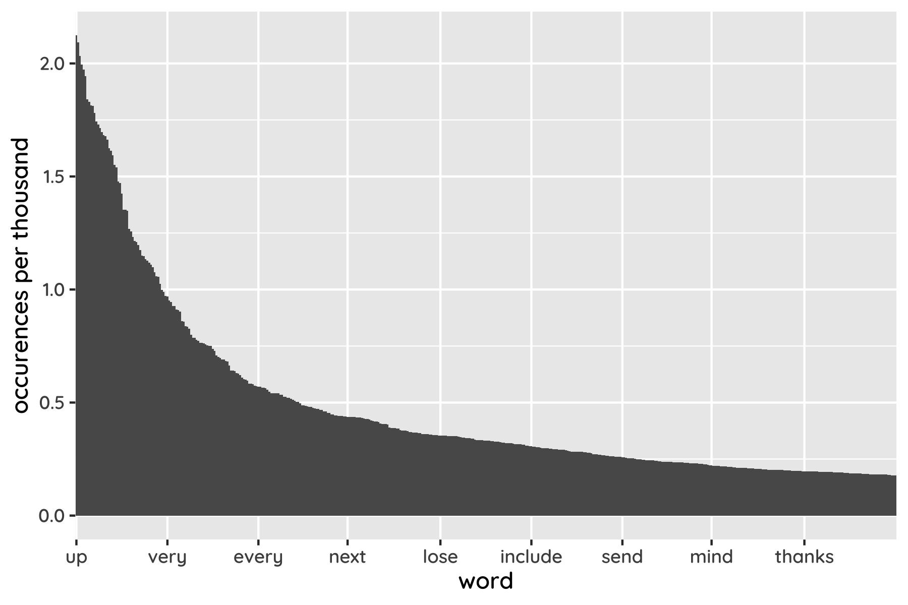

A friend of mine was recently given an interview task: a spec for a simple command-line tool, along with ten or so increasingly fiddly feature requests, in case of any free time before the two-hour deadline. I wanted to know if ChatGPT's O3 model was hireable, so I handed over the PDF and got back an answer. As someone who's barely written a line of Rust in my life, the thing was done in about twenty minutes; most of that was me checking it all worked as promised.

Clearly, tools like this will have implications for the hiring process – if you think there'll be any programmers left to hire [in a year or two](https://ai-2027.com/). Personally I'm sceptical of the most aggressive timelines: robotaxis have seemed [just around the corner](https://www.theguardian.com/technology/2015/sep/13/self-driving-cars-bmw-google-2020-driving) for a decade now, and the self-driving software engineer may be a similar mirage.[^singularity] But the impact would be profound even if progress halted today.

[^singularity]: I generally feel pretty confident predicting against the AI singularity, because if I turn out to be wrong, you're not going to care anyway.

For someone working on a [new programming language](https://mikeinnes.io/posts/raven/) this could provoke something of an existential crisis – is it too late? Am I, fundamentally, wasting my time? So I've thought a lot about how these changes will affect the tools we use – programming languages – and the people who use them.

## I, Copilot

Start with languages themselves. Even in the most [Yudkowskian](https://www.decisionproblem.com/paperclips/index2.html) AI takeover scenario, I don't think they'll disappear entirely. Just as there's plenty of COBOL code [still chugging away](https://timthewebmaster.com/en/articles/cobol-programming-language-history/) in mainframes, new technologies tend to layer on top of old, like chalk on the ocean floor.

If AI programmers get good enough, actually reading and writing code could become as odd as working with assembly is today – but code will nevertheless be there as an artefact. Language models can and will interpret badly-drawn flowcharts and monologues about your next big app idea, but there's just no reason for them not to turn repeated logic into code, for efficiency and reliability reasons. And that's before you get to accountability needs in medicine or aerospace.

But that's not to say there won't be changes, especially for middling languages. In general, popularity – of tools, words, celebrities, whatever – tends to follow a power law, like this:

The shape of this graph is where the tech cliché of the "long tail" comes from. In a normal distribution, like the bell curve of humans heights, the number of examples drops exponentially as you move away from the average – so there are very few people with unusual heights. That sounds tautological, but it's not true of a power law, where the right side is relatively flat: a very small number of words are popular while the vast majority are unusual. In linguistics this is Zipf's law. Well-educated native speakers know about 20,000 words, but when curating a dataset of words in English, I ended up with about 100,000 unique ones; those last 80,000 you've never heard of are the long tail.

I bring this up because technology – automation, the internet – tends to make those popularity curves steeper and longer. Rather than a lot of middling options, you have an increasingly small set of huge standouts, and an ever-longer tail of curios. Music is a striking example. Millions more people make it today than did twenty years go, production and distribution being easier than ever. Yet there's only one Taylor Swift, who earns more than the next several artists combined.[^swift] (The [same is happening](https://dspace.lib.cranfield.ac.uk/server/api/core/bitstreams/faf31478-933d-43ce-a938-cc9db3978a95/content) with Zipf's law as the internet unites the world around a main dialect, while also cultivating countless niche communities with their own jargon.)

[^swift]: Swift earned [over a billion dollars](https://news.pollstar.com/2024/12/16/2024yearendhub/) touring last year, more than double the next-biggest artist (Coldplay at $420m). [Twenty years ago](https://www.latimes.com/archives/la-xpm-2006-jan-10-et-ultimate10-story.html) the top 10 were both much smaller and much closer together, with The Rolling Stones topping out at $168m. Even adjusting for inflation, Swift today eclipses the then top 5.

In the case of programming languages specifically, the tail will fatten because the barrier to both creating and using weird languages is lowered. AI accelerates development and enables more custom tools and interfaces. It'll also help users directly by guiding them through unfamiliar territory. Lively library ecosystems matter less when models can spit out common functionality in seconds: BFGS optimiser in TensorFlow.js? Sure, I'll have it on your desk once you've blinked a couple of times. You can pick the perfect tool for the job, with fewer incidental constraints.

But this implies the other end of the curve getting steeper, too. Language choice will matter even less to people who are not hand-writing most of the code, increasing the tendency to make safe, default choices. Which means a growing share of the programming pie gets allocated to already-big languages like Java and Python, even as niche languages flourish. That's good and bad news for upstarts: it increases the odds of success while also putting a cap on the size of it.

## Confessions of an AI artist

From a language design perspective, though, it's not all that reassuring if code merely continues to exist, buried deep in the internals of our chatbots. If a tree falls in the forest, and only AI is around to hear it, does it make a sound?

Fortunately I'm not that worried about programmers becoming obsolete, even if the workday is changing. An AI "agent" like [Copilot](https://github.com/features/copilot) or [Claude Code](https://docs.anthropic.com/en/docs/claude-code/overview) is less like a fully-fledged engineer than an over-keen intern who is very willing to do all the googling and hacking, only to come back with something deranged. No, Claude, hard-coding the expected output into a `print` statement is not a valid solution. As amazing as these models can be, it's hard to avoid a sense of frustration: If ChatGPT again tries to convince me that the code works on its machine, I'll defenestrate my laptop. And I'll never not be unnerved by Copilot following my carefully hand-written lines with `// TODO this is wrong`.

Of course, it would be foolish to think every current problem is fundamental: this is the worst it'll ever be. But it's equally naive to assume transformers have no limitations. And at the risk of being self-serving, I think it's hard to do tasteful design and architecture; to develop the engineering spidey-sense to tell an elegant shortcut from a grubby hack, the refined palate to sniff out code smells that might erupt only years down the line. Language models are amazing at the details and bad at the big picture, and if you're not conscious of this you'll quickly have a [very large pile](https://x.com/karpathy/status/1886192184808149383) of very unmaintainable code on your hands. Conversely, taking the reins feels like being a newspaper editor: I'm not writing every line, but I can and will review each one, because I'm responsible for the overall direction and style. AI is an amplifier.

For that reason I'm also less worried about skills atrophy. Not because it won't happen, but because it's a natural part of progress, in the same way people no longer typically [write machine code](https://x.com/ID_AA_Carmack/status/1909311174845329874), [practice long division](https://www.washingtonpost.com/archive/local/1986/04/04/math-teachers-stage-a-calculated-protest/c003ddaf-b86f-4f2b-92ca-08533f3a5896/) or [memorise the Odyssey](https://www.goodreads.com/quotes/259062-if-men-learn-this-it-will-implant-forgetfulness-in-their). Most people will be able to build apps without any special skill, and average developers will struggle to stand out in the crowd, but the most ambitious will be exposed to the right challenges more quickly (rather than first gathering encyclopaedic knowledge of JS syntax quirks).[^skills] This group will be focused on complex, novel systems rather than basic web apps, and will be even more productive and impressive. There's that [power law](https://stratechery.com/2024/mkbhds-for-everything/) again.

[^skills]: It's notable that the most valuable, executive skills are the least visible to laymen. As an outsider you'd be forgiven for thinking that AI can easily replace programmers, exactly because you don't have the experience to tell high-quality work from mediocre. Something similar probably applies to art. AI in visual arts seem to generate far for worry than, say, fiction writing, and I suspect the difference lies in the public imagination more than professional opinion.

## How to train your golem

The "sleepless intern" view of AI is in turn suggestive for how it will affect tooling. Big corporate languages like Java and Go are underrated by language nerds, but they work well with unreliable bots for the same reason as with unreliable human teams: emphasising readability, and forcing you to write boring code, means your (virtual or not) intern can only go so far wrong, and mistakes should stand out in review. Once again AI reinforces the success of those existing systems.

That's far from my personal preference. I like expressive, dynamic languages like Clojure and Julia, and I want to build elegant, minimal, malleable systems, starting out rough and sculpting them into existence. When you're flying solo and can hold the project in your head, there's nothing like it. But I'm a hypocrite too: if I have to work with your crappy code, best believe I want types. Language models seem to have similar revealed preferences, and it's remarkable how much more effective they are when armed with a type checker. That benefit is becoming too big to ignore, even for smaller projects. We're all building pyramids now.[^pyramid]

[^pyramid]: "Pascal is for building pyramids—imposing, breathtaking, static structures built by armies pushing heavy blocks into place. Lisp is for building organisms—imposing, breathtaking, dynamic structures built by squads fitting fluctuating myriads of simpler organisms into place." (Alan J Perlis)

Static analysis is also valuable for machine-readable documentation. If language models have one clear superpower, it's grokking vast amounts of semi-structured data in an instant. I regularly feed them a 10k-line codebase, wholesale, to great effect. But this only scales so far, and you can expect to see tools for summarising libraries and projects in ways that would be far too dense for a human reader. Copilot and co are all the more impressive for the fact that they come into your codebase fresh every time; to be even more effective, they need help preserving context, on their own terms. Even for docs ultimately aimed at people, I would not be surprised to see [dense, queryable summaries](https://github.com/marv1nnnnn/llm-min.txt) taking priority over long programming manuals: it's simply more efficient to rely on the AI's background knowledge than to repeat basic tips in every tutorial.

That the industry is moving towards lightweight static type systems is hardly a mind-blowing prediction. But again, AI reinforces an existing trend, and I think this is general: language models are another rung on the ladder of automation, albeit a significant one, rather than a complete revolution.

If there's a running theme, it's that bots are idiot savants, capable of stunning intelligence and hair-pulling stupidity at the same time. This generation of tools will be at their best when, instead of playing Pinocchio, they lean into the weirdness, making up for our shortcomings while we keep an eye on theirs. I'm looking for dialogue more than agency, guidance and possibilities instead of narrow answers, amplified creation over optimised consumption. I want to sit firmly in the driver's seat and keep an eye on the road – for the time being, anyway.
